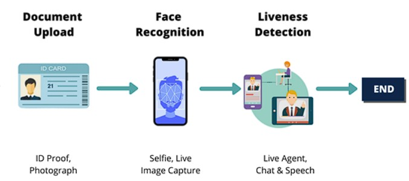

# eKYC – by Pankaj Mahanta

## Update
- 7/12/2024: The source code has been rewritten and tested to be compatible with the VGGFace2 model (InceptionResnetV1). Tested using Norm L2 for face matching.

---

**eKYC (Electronic Know Your Customer)** is a project designed to electronically verify the identity of customers. This system ensures authenticity and security in online transactions using biometric recognition and AI.


It allows banks and institutions to identify customers entirely online, without face-to-face interactions. The system uses facial recognition and liveness detection to ensure the user is present and real.

---

## 🔄 eKYC Process Flow

The eKYC process includes three key components:

1. **Upload Document (ID Card)**
2. **Face Verification**
3. **Liveness Detection**



---

### 1. Upload Document (ID Card)
Users are required to upload an image of their ID card. The system extracts facial information from the ID photo.

### 2. Face Verification

- **Step 1 - Still Face Capture**: User positions their face in front of the camera.
- **Step 2 - Face Matching**: The live face is matched against the ID card photo using deep facial recognition (InceptionResnetV1).

### 3. Liveness Detection

To prevent spoofing with photos or video replays, users must perform live actions:

- **Step 3 - Liveness Challenge**: Blink, smile, or turn head as prompted.
- **Step 4 - Verification**: If actions are performed correctly, identity is verified successfully.

---

## ⚙️ Installation

```bash
git clone https://github.com/pankajMahanto/eKYC
cd eKYC
pip install -r requirements.txt
```

---

## 📦 Pretrained Models

Download and place the pretrained models:

- Face Verification (InceptionResnetV1):  
  [Google Drive Link](https://drive.google.com/drive/folders/1QPSX08O6PbEyS4o8Xf45MaEAqvN6f_Ge?usp=sharing) → Place in `verification_models/weights`

- Liveness Detection:  
  Download pretrained weights and landmarks → Place in `liveness_detection/landmarks`

---

## 🚀 Usage (GUI Mode)

```bash
python main.py
```

Runs the PyQt5 GUI for full eKYC interaction.

---

## 🧪 Results

> ⚠️ Personal video demos have been removed to protect privacy.  
> You can test using any ID photo and webcam.

---

## 👤 Author

**Pankaj Mahanta**  
🔗 GitHub: [pankajMahanto](https://github.com/pankajMahanto)
